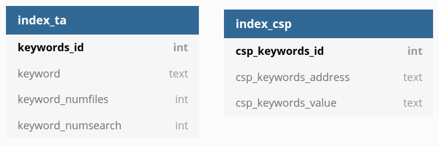

# Symmetric searchable encryption database 
An implementation of a searchable encryption database with forward privacy, following 
the paper [Power Range: Forward Private Multi-Client Symmetric Searchable Encryption with 
Range Queries Support](https://ieeexplore.ieee.org/abstract/document/9219739) [Alexandros Bakas, Antonis Michalas].

Requirements:

python >= 3.7 \
cryptography=3.1.1 \
hydra-core=1.0.4 \
pycryptodome=3.9.8 \
tqdm=4.55.1

Automatically install necessary packages using conda: run
```conda create --name <envname> --file requirements.yaml```. 


The configurations are controlled by the values in ```config.yaml```.
When proper configurations are configured, run ```python main.py``` and follow the instructions.

The figure below shows the tables that contain the indexes of the encrypted database, which are generated
by the indexing algorithm. These tables are updated accordingly when the data owner add a file to the
database, search a word, or delete a file.

